# Sports Bet App

A sports betting app UI for iOS and Android, built with [Expo](https://expo.dev) and [Expo UI](https://docs.expo.dev/versions/latest/sdk/ui/). Expo UI renders real SwiftUI on iOS and Jetpack Compose on Android from a single React component tree.

It covers football, basketball and tennis. It's a UI demo only: matches, odds and bets are mock data kept in memory, amounts are in Naira (₦), and no real money is involved.

## Screenshots

| Screen | iOS · Light | iOS · Dark | Android · Light | Android · Dark |
| --- | --- | --- | --- | --- |
| **Sports** | 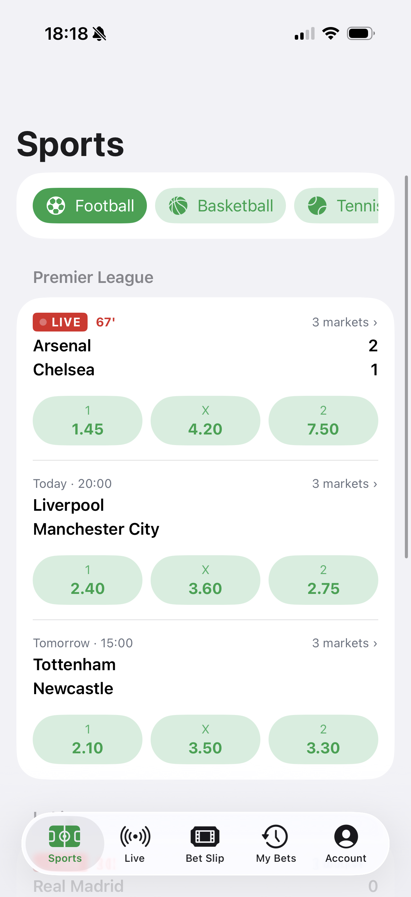 | 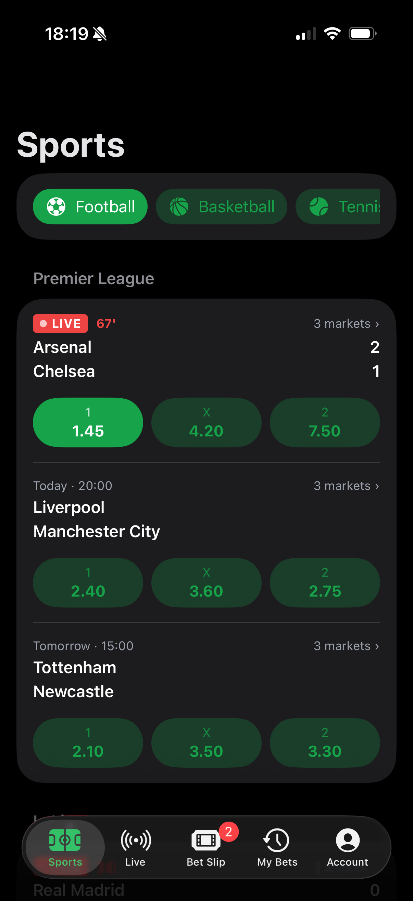 | 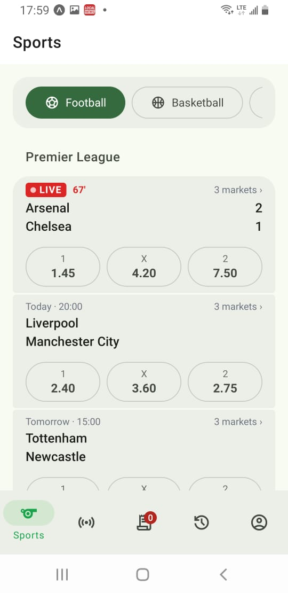 | 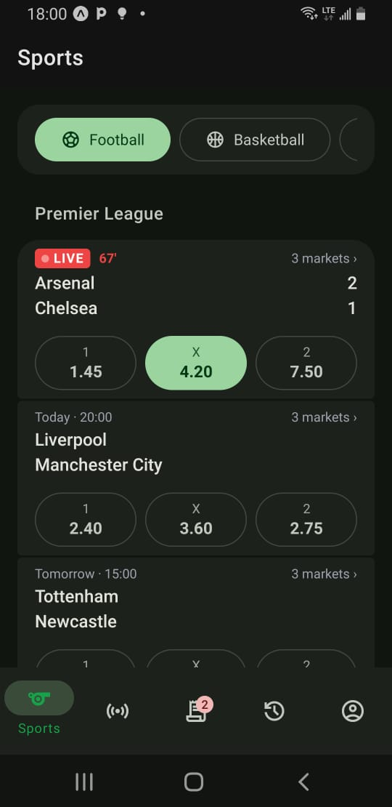 |
| **Live** | 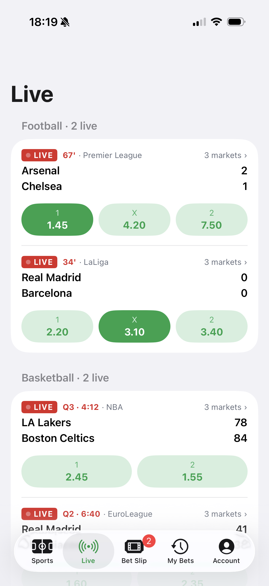 | 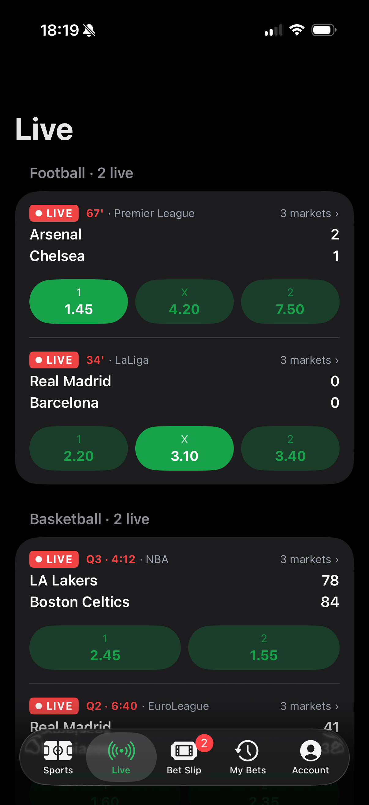 | 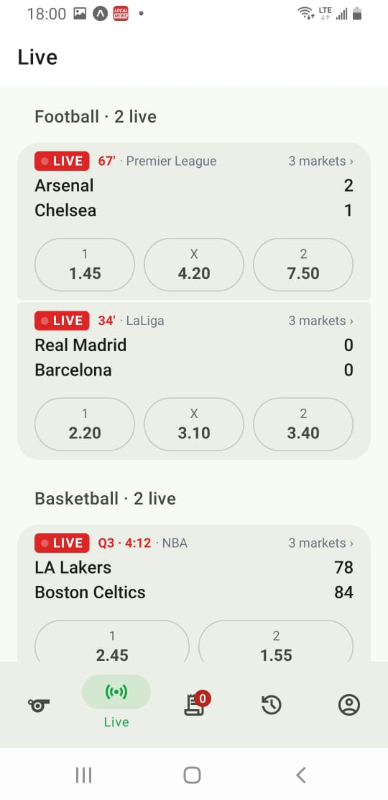 | 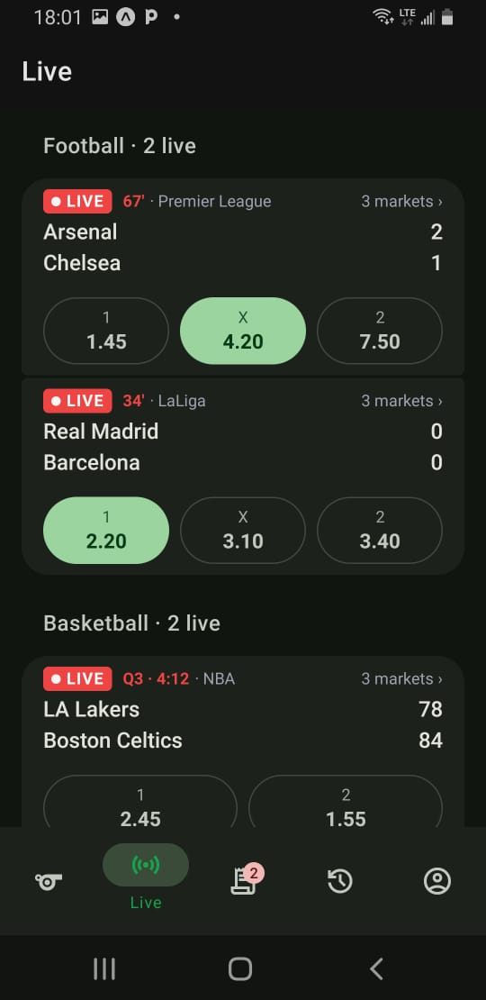 |
| **Bet Slip** | 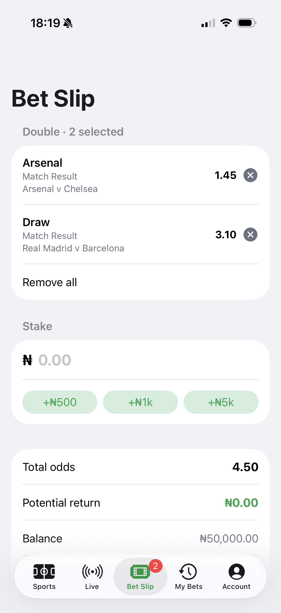 | 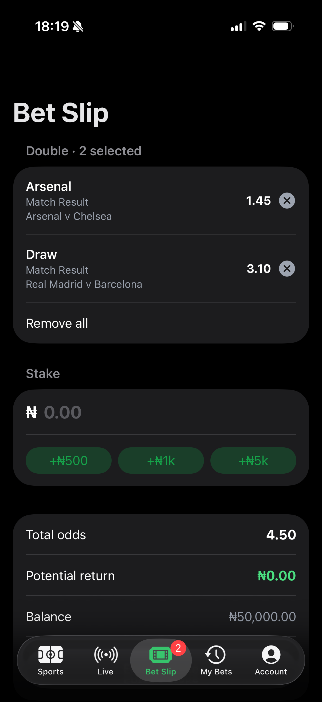 | 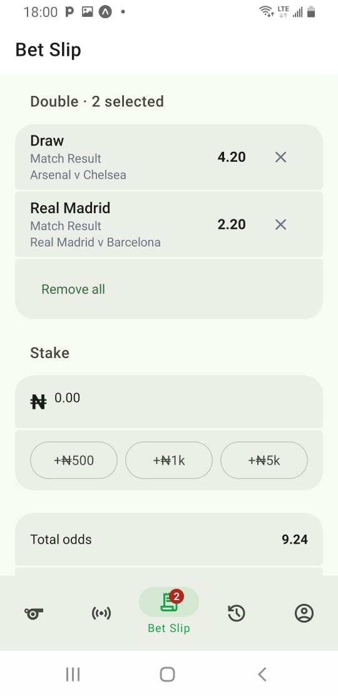 | 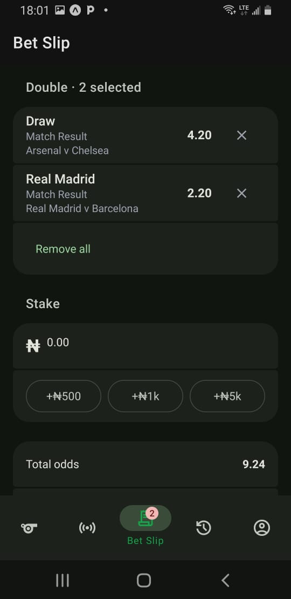 |
| **My Bets** | 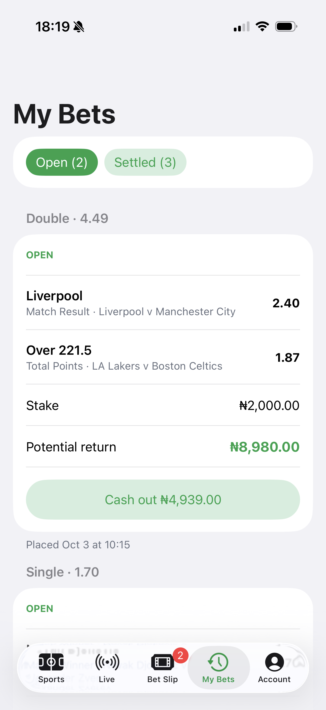 | 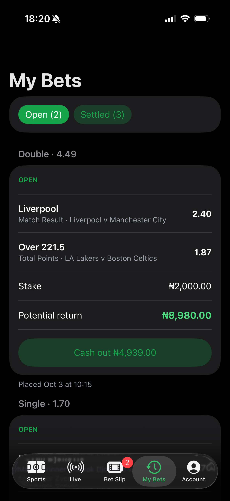 | 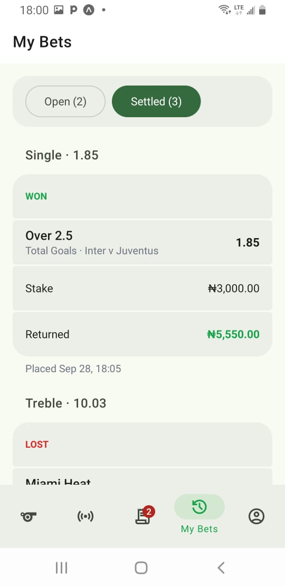 | 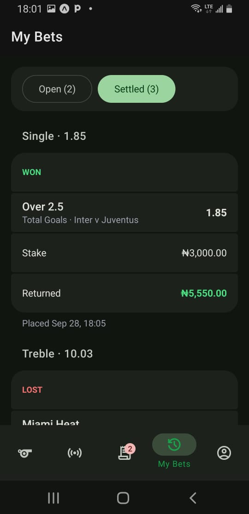 |
| **Account** | 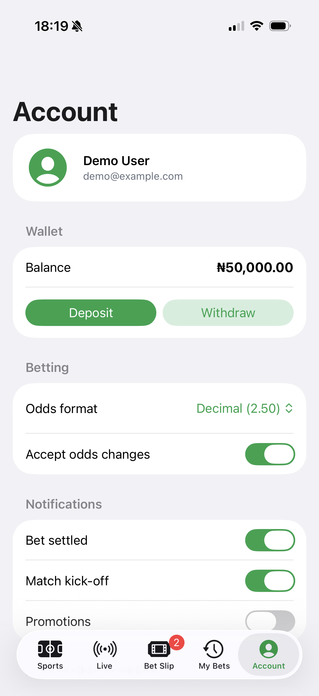 | 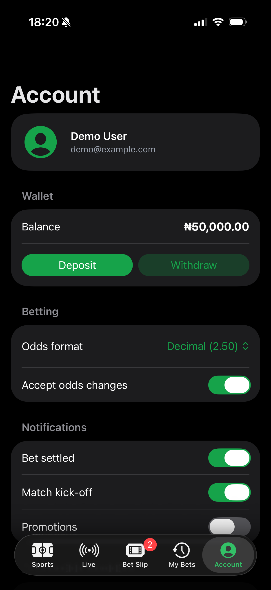 | 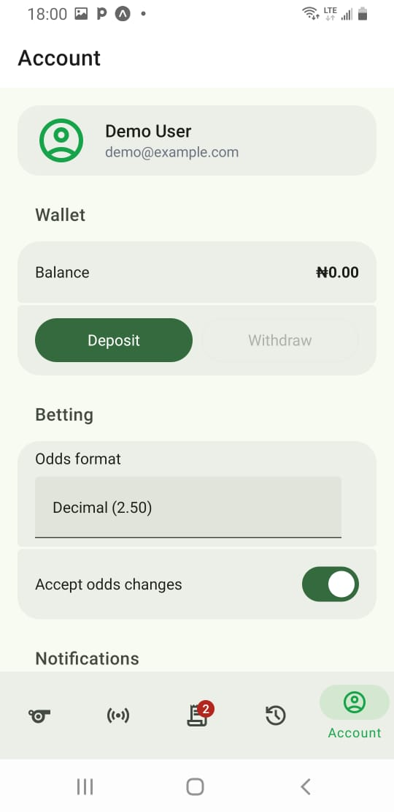 | 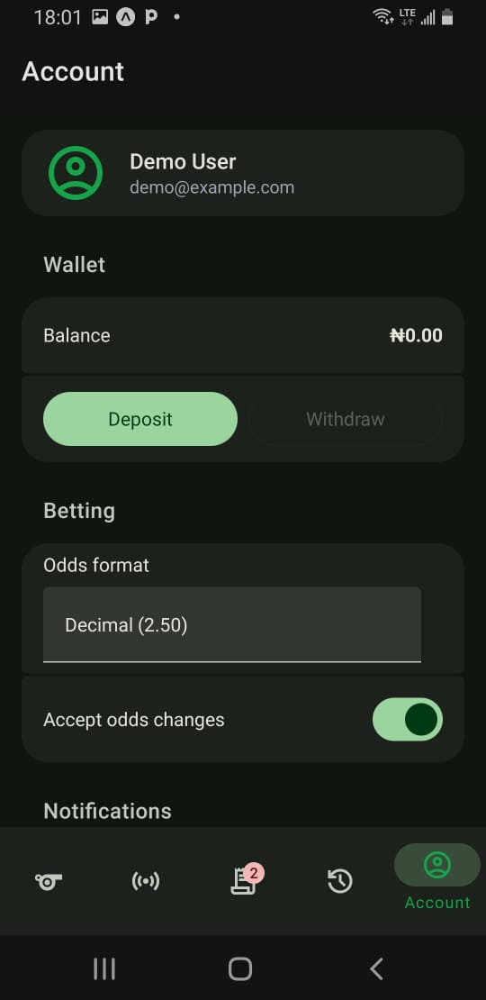 |

## Features

- **Sports**: switch between football, basketball and tennis. Matches are grouped by competition, and tapping a price adds it to the bet slip.
- **Live**: in-play matches with live scores and a pulsing LIVE badge.
- **Match details**: every market for a match.
- **Bet Slip**: singles and accumulators, stake entry with quick-stake buttons, potential return, and a receipt when the bet is placed.
- **My Bets**: open and settled bets, with cash out for open bets.
- **Account**: deposit and withdraw, odds format (decimal, fractional or American), notification settings and a deposit limit.
- Light and dark mode on both platforms.

## Tech stack

- Expo SDK 57 and React Native
- [Expo Router](https://docs.expo.dev/router/introduction/) with native tabs
- [Expo UI](https://docs.expo.dev/versions/latest/sdk/ui/) (`@expo/ui`) universal components
- TypeScript

## Getting started

```bash
npm install
npx expo start
```

Then open the app on a device with [Expo Go](https://expo.dev/go) by scanning the QR code, or press `i` for the iOS Simulator or `a` for an Android emulator. Web isn't supported.

## Project structure

```
src/
  app/          Routes (Expo Router): tabs, screens and their layouts
  components/   Shared Expo UI components
  constants/    Theme and navigation options
  data/         Mock fixtures and bet history
  store/        Betting state: wallet, bet slip and placed bets
  utils/        Odds, money and bet calculations
screenshots/    Images used in this README
```

## License

[MIT](LICENSE)
